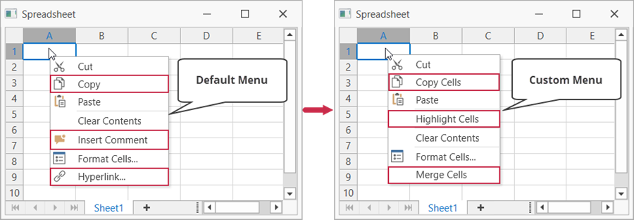

<!-- default badges list -->

<!-- default badges end -->
# WPF Spreadsheet - How to Customize Context Menus 

This example demonstrates how to customize the [Cell](https://docs.devexpress.com/WPF/119005/controls-and-libraries/spreadsheet/visual-elements/pop-up-menus) context menu of the WPF Spreadsheet control.

Add the required [bar actions](https://docs.devexpress.com/WPF/7045/controls-and-libraries/ribbon-bars-and-menu/bars/bar-actions) to the [SpreadsheetControl.MenuCustomizations](https://docs.devexpress.com/WPF/DevExpress.Xpf.Spreadsheet.SpreadsheetControl.MenuCustomizations) collection to create, modify or remove menu items.

## Files to Look At

* [MainWindow.xaml](./CS/WpfSpreadsheetMenuCustomization/MainWindow.xaml) (VB: [MainWindow.xaml](./VB/WpfSpreadsheetMenuCustomization/MainWindow.xaml))
* [MainWindow.xaml.cs](./CS/WpfSpreadsheetMenuCustomization/MainWindow.xaml.cs) (VB: [MainWindow.xaml.vb](./VB/WpfSpreadsheetMenuCustomization/MainWindow.xaml.vb))

